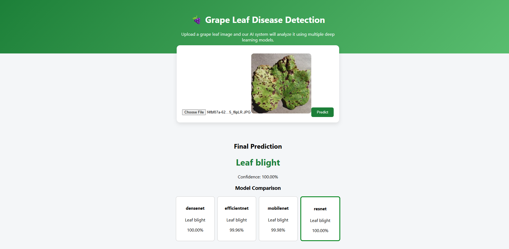

# 🍇 GrapeCare: Intelligent Deep Learning-Based Grape Disease Detection
## INTRODUCTION

GrapeCare is a deep learning-based intelligent system developed to automatically detect diseases in grape leaves using image processing and transfer learning techniques.

Traditional methods of disease detection in agriculture rely heavily on manual inspection, which can be:

Subjective
Time-consuming
Prone to human error

To overcome these challenges, GrapeCare offers an automated, accurate, and scalable solution for early disease detection in vineyards. This enables farmers to take timely and informed decisions, ultimately improving crop health and productivity.

## OBJECTIVE
To develop an automated system for detecting grape leaf diseases
To utilize image processing and deep learning models for accurate prediction
To identify diseases at early stages and minimize crop loss
To provide a scalable and cost-effective solution for agricultural applications
3. SOFTWARE REQUIREMENTS

Operating System: Windows / Linux / macOS
Programming Languages: Python 3.x, JavaScript (React)
IDE: VS Code / Jupyter Notebook / Google Colab

## Libraries Used

Backend (Python):

TensorFlow / Keras
NumPy
OpenCV
Flask
Scikit-learn

Frontend (React):

React.js
Axios
HTML / CSS
## SALIENT FEATURES
Non-invasive, image-based disease detection
Implementation of CNN with transfer learning
Support for multiple deep learning models:
DenseNet121
EfficientNetB0
ResNet50
MobileNetV2
Model comparison with accuracy evaluation
Real-time prediction through a web interface
Displays prediction confidence scores
Clean, intuitive, and user-friendly interface

## DATASET DESCRIPTION

The dataset consists of grape leaf images categorized into the following four classes:

Grape Black Rot
Grape Esca (Black Measles)
Grape Leaf Blight
Healthy

All images are resized to 128 × 128 pixels and enhanced using data augmentation techniques such as:

Rotation
Flipping
Zooming
Shifting

These techniques help improve model generalization and overall performance.

## PROJECT SCREENSHOTS
Prediction Output
 

## COMPILATION / EXECUTION PROCEDURE
Step 1: Install Dependencies
pip install tensorflow numpy opencv-python flask scikit-learn
npm install
Step 2: Run Backend
python app.py
Step 3: Run Frontend
cd frontend
npm start
## PROCEDURE TO RUN THE PROJECT
Load the grape leaf dataset
Preprocess images (resize, normalize, and augment)
Train models using transfer learning techniques
Evaluate model performance using test data
Start the Flask backend server
Upload a grape leaf image through the frontend interface
The system predicts the disease using multiple models
Output Includes:
Final prediction
Confidence score
Model comparison results
## WORKING OF THE SYSTEM
Input:
Grape leaf image
Processing Steps:
Resize the image to 128 × 128 pixels
Normalize pixel values
Apply data augmentation techniques
Extract features using pretrained CNN models
Classify using the trained model
Output:
Predicted disease class
Confidence score
Model comparison results
## LIMITATIONS
Requires clear and high-quality input images
Accuracy depends on dataset size and diversity
Training deep learning models requires significant computational resources
Not optimized for real-time field deployment without further improvements
## FUTURE ENHANCEMENTS
Deployment as a mobile application
Real-time disease detection using camera input
Integration with IoT-based smart farming systems
Providing treatment recommendations for detected diseases
Extending the system to support other crops and plant diseases
## CONCLUSION

The GrapeCare system effectively detects grape leaf diseases using image-based deep learning techniques.

It reduces reliance on manual inspection and provides a fast, reliable, and scalable solution for farmers. By leveraging transfer learning models, the system enhances early disease detection, helping to reduce crop loss and improve overall agricultural productivity.
